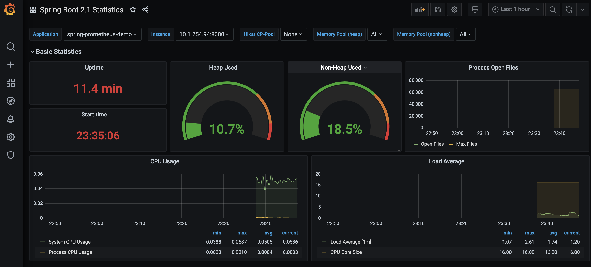

# Spring Boot Microservice on Kubernetes with Prometheus + Grafana Monitoring
We are using Microk8s in our example

### Generate Spring Boot Microservice
See: https://github.com/mazrc/springboot-on-kubernetes`

Quick test:
```
./mvnw spring-boot:run
```
### Enable Prometheus on Microk8s
microk8s enable prometheus
port forward grafana on port 3000
goto to localhost:3000 and install springboot dashboard
click on + sign and add dashboard # 10280 

### Create K8s Configuration and deploy the app
```
---
apiVersion: apps/v1
kind: Deployment
metadata:
  name: ms1
  labels:
    app: ms1
spec:
  replicas: 1
  selector:
    matchLabels:
      app: ms1
  template:
    metadata:
      labels:
        app: ms1
    spec:
      containers:
      - name: ms1
        image: localhost:32000/ms1-beta1:registry
        imagePullPolicy: Always
        ports:
        - containerPort: 8080

---
apiVersion: v1
kind: Service
metadata:
  name: ms1-service
  labels:
    app: ms1
spec:
  selector:
    app: ms1
  ports:
    - protocol: TCP
      name: http-traffic
      port: 8080
      targetPort: 8080

---
apiVersion: monitoring.coreos.com/v1
kind: ServiceMonitor
metadata:
  name: spring-prometheus-demo-service-monitor
spec:
  selector:
    matchLabels:
      app: ms1
  endpoints:
  - port: http-traffic
    path: "/actuator/prometheus"
```

Deploy the application:

`
kubectl apply -f deploy.yaml;
`

### Test the App on K8s

To access the app we can use kubectl port-forward

kubectl port-forward svc/ms1-service 8080:8080
curl http://local:8080

### Build and Push Container to local cluster (i.e., Microk8s)
./push-to-registry.sh service version registry:port deploymentName

Example:
./push-to-registry.sh ms1 beta1 192.168.64.2:32000 ms1beta1

#### Redeploy
./redeploy.sh

### Enjoy Springboot Grafana Dashboard



